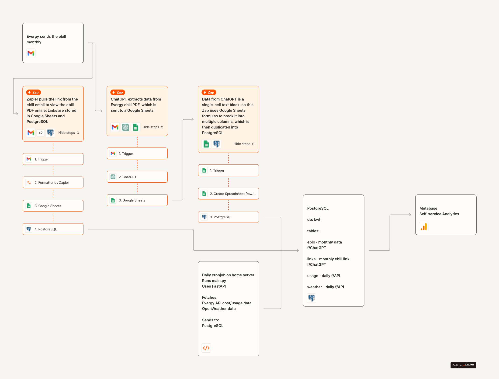

# ⚡Evergy Usage & Solar Production Dashboard
Evergy API → PostgreSQL
 
Evergy ebill → ChatGPT → PostgreSQL
 
PostgreSQL → Metabase

> **Note: This is uses Evergy's non-public API.**

 
## Project Overview
This project is a fork of the original Evergy Client by Lawrence Foley, enhanced to pull all available data from Evergy. It is integrated into a comprehensive data pipeline that automates the collection and analysis of Evergy e-bill and usage data.

## Data Extraction
Evergy sends the e-bill monthly via email.
Zapier extracts the link from the email and saves it to Google Sheets and PostgreSQL.

## Data Processing
ChatGPT parses the e-bill PDF, and the data is sent to Google Sheets.
Data from Google Sheets is further processed and inserted into PostgreSQL.

## Automation
A daily cron job runs main.py, which fetches Evergy API cost/usage data and OpenWeather data, sending it to PostgreSQL.

## Analytics
Data is visualized using Metabase for self-service analytics.

## Enhanced Functionality
Extended Data Retrieval: This version pulls all available data from Evergy, providing a more comprehensive dataset for analysis compared to the original project.
