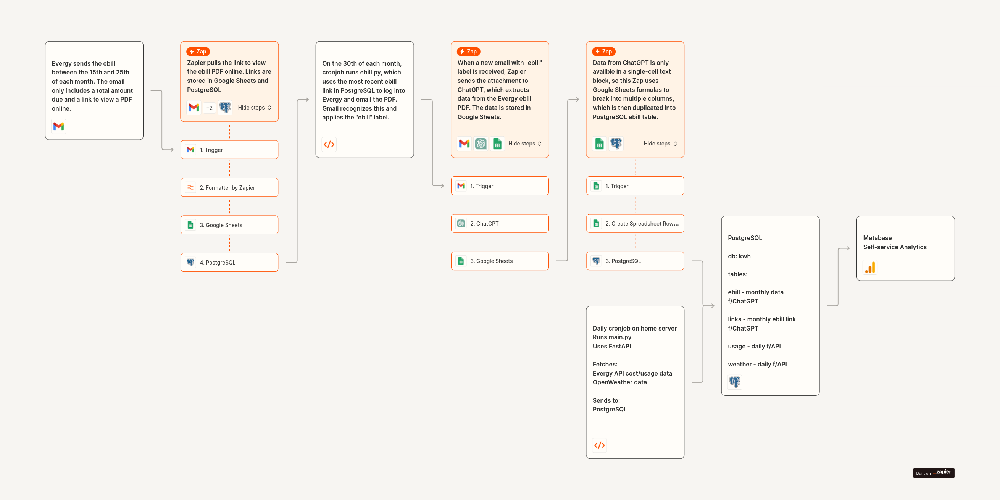

# ⚡Evergy Usage & Solar Production Dashboard
Evergy API → PostgreSQL
 
Evergy ebill → ChatGPT → PostgreSQL
 
PostgreSQL → Metabase

> **Note: This is uses Evergy's non-public API.**

 
## Project Overview
- Enhanced version of the original Evergy Client by Lawrence Foley.
- Integrated into a comprehensive data pipeline.
- Automates collection and analysis of Evergy e-bill and usage data.

## Data Extraction
- Evergy sends the e-bill via email between the 15th and 25th of each month.
- Zapier extracts the link to the e-bill PDF from the email.
- The link is stored in both Google Sheets and PostgreSQL.
  
## Data Processing
- Python script (ebill.py) takes the link from PostgreSQL.
  - Logs into Evergy and retrieves the PDF e-bill online.
  - Sends the PDF e-bill in an email.
- ChatGPT parses the e-bill PDF.
- Extracted data is sent to Google Sheets.
- Zapier processes the data in Google Sheets.
  - Breaks data into multiple columns.
  - Inserts processed data into PostgreSQL.

## Automation
- A daily cron job runs main.py.
  - Fetches Evergy API cost/usage data.
  - Fetches OpenWeather data.
  - Sends data to PostgreSQL.
- A cron job on the 30th of each month runs ebill.py.
  - Takes the link from PostgreSQL.
  - Logs into Evergy to retrieve and email the PDF e-bill.

## Analytics
- Data is visualized using Metabase.
  - Provides self-service analytics.
  - Enables comprehensive analysis of energy usage and solar production.

## Enhanced Functionality
- Extended Data Retrieval:
  - Pulls all available data from Evergy.
  - Provides a more comprehensive dataset for analysis compared to the original project.
